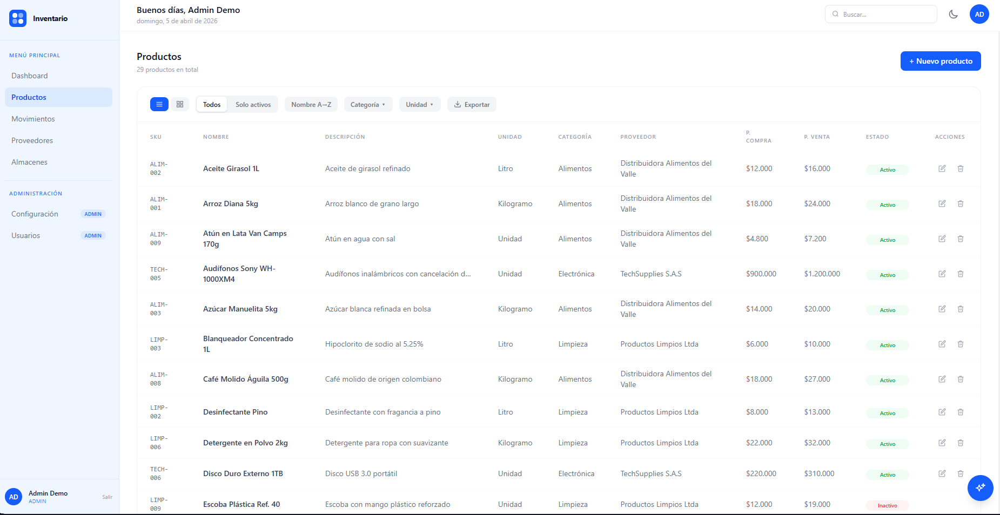
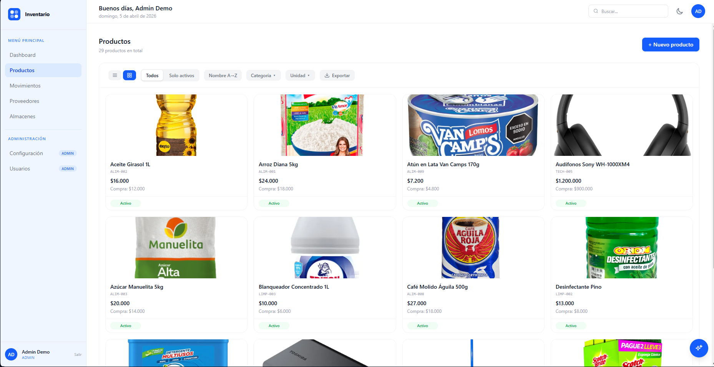
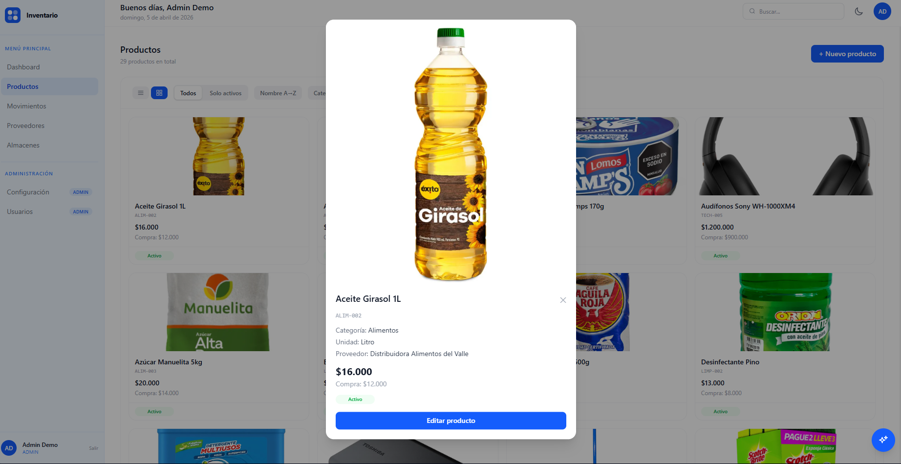
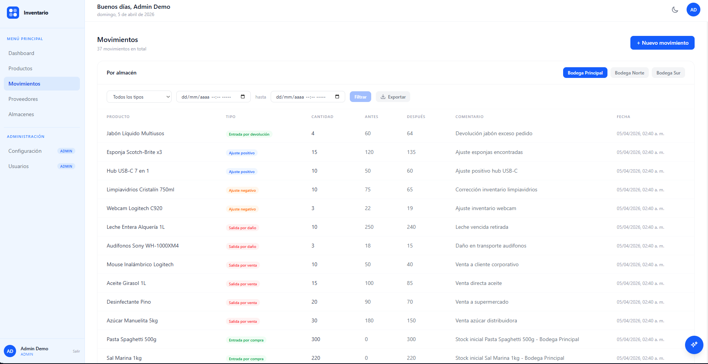
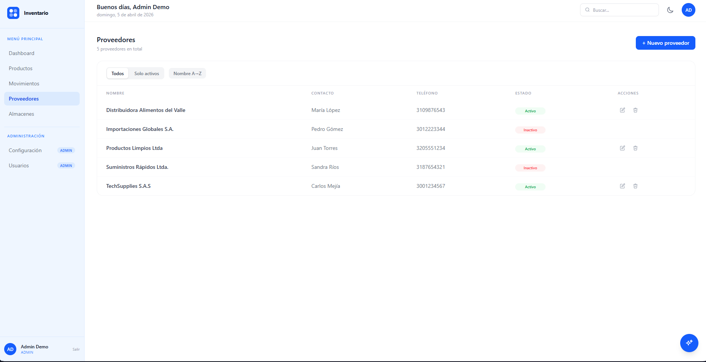
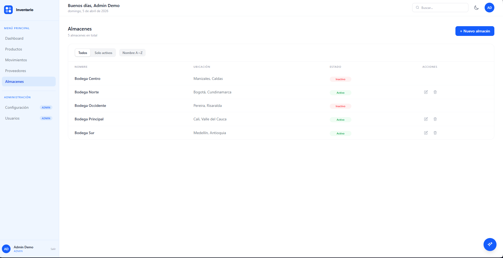
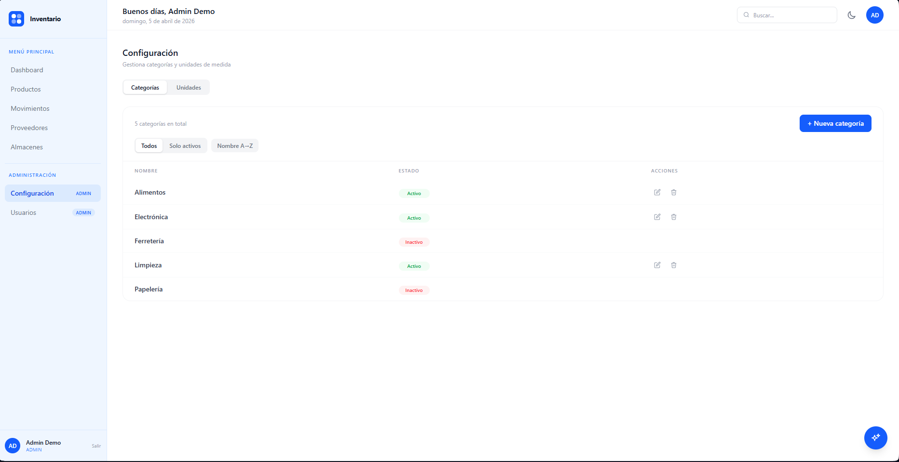
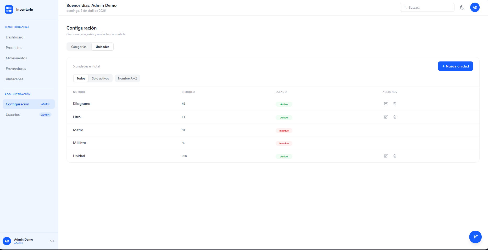

# Inventory Management System

A full-stack inventory management system built as a portfolio project, showcasing Clean Architecture, AI integration, and modern web development practices.

**[Live Demo](https://inventory.nicoleroldan.com)** · **[Backend Repository](https://github.com/nicolerol28/inventory-system-backend)** · **[Frontend Repository](https://github.com/nicolerol28/inventory-system-frontend)**

> Demo credentials — click **"Probar demo"** ("Try demo") on the login page for instant access with pre-seeded data. Data resets nightly to ensure a consistent experience for every visitor.

---

## Contents

- [Screenshots](#screenshots)
- [Tech Stack](#tech-stack)
- [Features](#features)
- [Architecture](#architecture)
- [Testing](#testing)
- [Running Locally](#running-locally)
- [Known Technical Debt](#known-technical-debt)
- [Author](#author)

---

## Screenshots

### Login


### Dashboard with AI Insights


### Products — Table View


### Products — Catalog View


### Product Detail Modal


### Inventory Movements


### Suppliers


### Warehouses


### Settings — Categories


### Settings — Units


### Users


---

## Tech Stack

### Backend
| | |
|---|---|
| Language | Java 17 |
| Framework | Spring Boot 3.5 |
| Architecture | Clean Architecture + CQRS |
| Database | PostgreSQL |
| Migrations | Flyway |
| Auth | JWT + Google OAuth 2.0 |
| AI | Google Gemini 2.5 Flash |
| Storage | Cloudflare R2 (S3-compatible) |
| API Docs | SpringDoc OpenAPI (Swagger UI) |
| Deploy | Railway |

### Frontend
| | |
|---|---|
| Framework | React 19 + Vite |
| Styling | Tailwind CSS v4 |
| Server State | TanStack Query v5 |
| HTTP | Axios |
| Routing | React Router v7 |
| Charts | Recharts |
| Export | ExcelJS |
| Deploy | Vercel |

---

## Features

### Core Modules
- **Dashboard** — real-time KPIs (products, suppliers, warehouses), stock-by-warehouse table with editable minimums, low-stock bar chart
- **Products** — full CRUD with side panel drawer, table view and catalog view with product images, filters, pagination, search, Excel export
- **Inventory Movements** — register entries, exits, returns and adjustments per warehouse, date range filter, Excel export
- **Suppliers** — full CRUD with filters and pagination
- **Warehouses** — manage multiple storage locations
- **Settings** — categories and measurement units management (served by the `products` backend module)
- **Users** — admin-only user management with role-based access control

| Role | Permissions |
|---|---|
| `ADMIN` | Full access — includes user registration, user management, and all module operations |
| `OPERATOR` | Products, inventory, movements, suppliers and warehouses — cannot access settings or user management |

### AI Integration
- **Automatic inventory insights** on the Dashboard — powered by Gemini 2.5 Flash, analyzes current stock and generates 3 actionable insights (info / warning / critical) on every page load
- **AI Assistant** — floating chat panel available throughout the app, context-aware of current inventory state, with prompt injection protection and rate limiting

### Authentication
- **Email + password** login
- **Google OAuth 2.0** — sign in with Google (admin must create the account first)
- **Demo access** — one-click access to a pre-seeded environment, resets nightly via a Spring @Scheduled job that truncates all tables, resets sequences, and re-executes the Flyway seed scripts

### Product Images
- Upload product photos on create/edit (JPEG, PNG, WebP, max 5MB)
- Images stored in Cloudflare R2
- Catalog view with uniform image display
- Click any product card to open a detail modal with full-size image

### Excel Export
- Export products, movements, and stock to `.xlsx` with all active filters applied
- Full dataset export (not just current page)
- Implemented entirely on the frontend via ExcelJS — the backend returns paginated data, the client assembles and downloads the file

---

## Architecture

The backend follows **Clean Architecture** with strict layer separation:

```
interfaces (API)
    ↓
application (use cases, commands, queries)
    ↓
domain (models, repository interfaces)
    ↑
infrastructure (JPA, external services)
```

Key decisions:
- **CQRS** — read queries bypass the domain layer and go directly to JPA, avoiding unnecessary object reconstruction for read-only operations; write operations go through use cases, keeping business rules fully testable without a database
- **No ORM coupling in domain** — domain models are plain Java objects with no JPA annotations, meaning business rules are framework-independent
- **Gateway pattern** for external services — `StorageGateway` (R2), `GeminiGateway` (AI); the domain depends on interfaces, not on AWS SDK or Gemini SDK directly
- **Flyway** for versioned database migrations
- **JWT** stateless authentication with role-based authorization
- **AssistantGuard** — a dedicated guard class protecting the AI assistant endpoint with two mechanisms: a sliding-window rate limiter (10 requests/minute per IP, implemented in-memory with ConcurrentHashMap) and a prompt injection detector that pattern-matches against a blocklist of known injection phrases (e.g. "ignore previous", "jailbreak", "DAN"). Violations return 400 or 429 without ever reaching the Gemini gateway

The full API is documented and explorable via Swagger UI at `/swagger-ui/index.html`.

---

## Testing

**279 unit tests passing**, 94% instruction coverage and 96% branch coverage measured with JaCoCo. Layers without business logic (controllers, mappers, DTOs, repositories) are excluded from the coverage report.

### Stack
- **JUnit 5 + Mockito + AssertJ** for unit tests
- **Testcontainers + PostgreSQL** for integration tests on JPA repositories and native queries
- **JaCoCo** for coverage reports (`target/site/jacoco/index.html`)

### Methodology
Tests follow BDD structure (Given / When / Then) and are organized in three layers:

**Domain tests** — pure unit tests on the domain model. Verify factory method invariants (`create` sets `active = true` and timestamps; rejects blank fields), and that `reconstitute` rehydrates all fields without re-validating them.

**Use case tests** — each use case covers three mandatory scenarios:
1. Happy path — verifies result and repository interactions
2. Domain error — business rule violation throws the expected exception
3. Short-circuit — confirms that expensive operations (e.g. `save`) never run after an early failure, using `verify(..., never())`

`@ParameterizedTest` is used whenever multiple inputs produce the same exception type, avoiding repetitive test methods.

**Integration tests** — extend a shared `BaseIntegrationTest` that spins up a real PostgreSQL container via `@ServiceConnection`. Each test is self-contained and does not rely on Flyway seed data.
 
---

## Running Locally

### Prerequisites
- Java 17
- Node.js 18+
- Docker (for PostgreSQL via docker-compose)
- A Cloudflare R2 bucket
- A Google Cloud OAuth client
- A Gemini API key

### Backend

```bash
git clone https://github.com/nicolerol28/inventory-system
cd inventory-system
docker-compose up -d
cp .env.example .env
# Fill in your environment variables
./mvnw spring-boot:run
```

**Required environment variables:**

```env
DB_HOST=localhost
DB_PORT=5433
DB_NAME=your_db_name
DB_USER=your_db_user
DB_PASSWORD=your_db_password
JWT_SECRET=your_jwt_secret
JWT_EXPIRATION_MS=86400000
GEMINI_API_KEY=your_gemini_key
GOOGLE_CLIENT_ID=your_google_oauth_client_id
R2_ACCESS_KEY_ID=your_r2_access_key
R2_SECRET_ACCESS_KEY=your_r2_secret_key
R2_ENDPOINT=https://xxxx.r2.cloudflarestorage.com
R2_BUCKET_NAME=inventory-products
R2_PUBLIC_URL=https://pub-xxxx.r2.dev
```

### Frontend

```bash
git clone https://github.com/nicolerol28/inventory-system-frontend
cd inventory-system-frontend
cp .env.example .env
# Fill in your environment variables
npm install
npm run dev
```

**Required environment variables:**

```env
VITE_API_URL=http://localhost:8080/api/v1
VITE_GOOGLE_CLIENT_ID=your_google_oauth_client_id
```

---

## Known Technical Debt

The following trade-offs were made consciously during development and are documented here to demonstrate awareness of architectural boundaries, not as oversights:

- `GoogleLoginUseCase` should abstract the Google token verification behind a `GoogleTokenVerifier` port in domain — currently it holds HTTP logic (via `RestTemplate`) in the application layer
- `googleId` field in `User` domain model uses `String` instead of `Optional<String>` — forces null-checks in callers instead of making optionality explicit
- Orphaned images in R2 are not deleted when a product image is replaced — `StorageGateway` has no `deleteFile()` method; old files accumulate in the bucket
- `LoginUseCase` depends on Spring Security's `AuthenticationManager` — a framework dependency in the application layer, accepted as a pragmatic decision given Spring's auth model

---

## Author

**Nicole Roldan** · [nicoleroldan.com](https://nicoleroldan.com) · [GitHub](https://github.com/nicolerol28)
